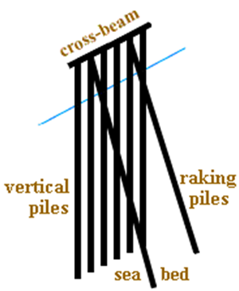
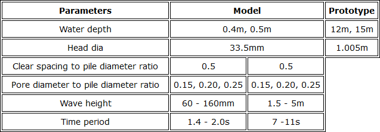
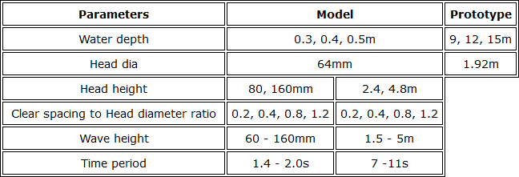

### INTRODUCTION 

Coastal erosion in any region needs to be addressed judiciously, if not, that can threaten settlements and economic interests of the region. As the erosion along the West Coast is primarily due to direct wave attack, it is important to take necessary measures for coastal protection which can reduce energy of waves reaching the shore.

Breakwater is an artificial offshore structure protecting a harbour, anchorage or marina basin from water waves. Breakwaters intercept longshore currents and tend to prevent beach erosion. When perfect tranquillity conditions are necessary large impermeable structures like rubble mound breakwaters and vertical wall breakwaters are used. But, for small recreational harbours or fisheries harbours and at locations where large littoral drift exist, permeable breakwaters are appropriate. A single / two rows of closely spaced circular piles of suitable diameter can act like a breakwater in such locations. Depending upon the tranquillity requirements and prevailing littoral movement conditions the pile breakwater can be designed suitably.

The advantages of pile breakwater are :

<ol  style="text-align: justify;">
<li>The sea water is kept relatively clean as pile breakwaters permits the circulation of water in and out of the harbour. Therefore it is environment friendly</li>
<li>The interference of pile breakwater with the littoral drift is least when compared to conventional breakwaters</li>
<li>More economical when compared to conventional rubble mound structures</li>
</ol>

Schematic Representation of Pile Breakwater
###### ( Source: [http://www.aholgate.com/marriv/glenbwtr.html](http://www.aholgate.com/marriv/glenbwtr.html) )

The wave attenuation characteristics of the pile breakwater is determined by calculation of the wave transmission coefficient (Kt).

Kt= Ht ÷ Hi

where Ht - transmitted wave height, Hi - incident wave height.

One such structure that helps in wave attenuation is Pile Breakwater. Pile breakwater is usually located away from the beach and it attenuates wave energy due to the turbulence caused by the wave structure interaction. They allow the incoming waves to pass through the gaps and hence reflection decreases, and also water circulation occurs within the protected area with no blocking or obstructing of any moving objects / organisms. Due to these reasons they are constructed for the protection of coast, without spoiling the beauty of the natural beach.

For solving the above problems, Computational Fluid Dynamics (CFD) is introduced, wherein full scaled, three dimensional perspective of the interactions can be obtained using a three dimensional numerical simulation. The concept of CFD is nothing but utilisation of advanced computing technology along with the development of accurate numerical algorithms for solving physical problems, as numerical simulations provide better insight into the physical processes which cannot be attained through experimental approach.

Wave-structure interaction on structures has been analytically evaluated, using different theories and formulae. In order to get accurate results, these are applicable only in ideal cases, where all the assumptions are fulfilled. In this scenario, it is beneficial to adopt numerical simulations. Interaction of waves with non-porous pile breakwater is simulated in a three dimensional numerical wave tank using REEF3D and resulted transmission co-efficient is validated using the physical model studies. Also, the efficiency of porous piles over non-porous piles are studied by simulating wave conditions by varying wave height, Wave period, water depth and percentage porosity of the piles.

Wave Flume Calibration Table

Further this study is extended by altering the model, i.e. increasing the pile diameter only at the head portion. Following are the various cases opted,

Wave Flume Calibration Table
 
