#### These procedure steps will be followed on the simulator

1. Click on Wave attenuation in Pile Based Breakwater, following window will open. Click on the experiment name to start it. 
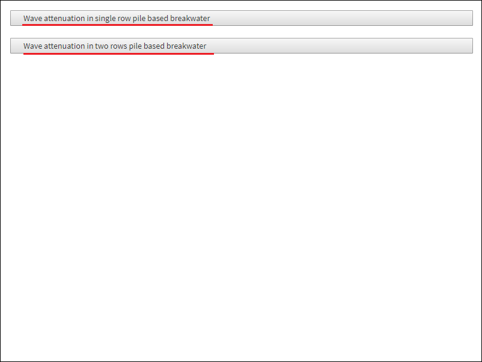 

#### Wave Attenuation in Single Row Pile Based Breakwater :

1. Go through the description and then click on NEXT button shown at the bottom right corner. 
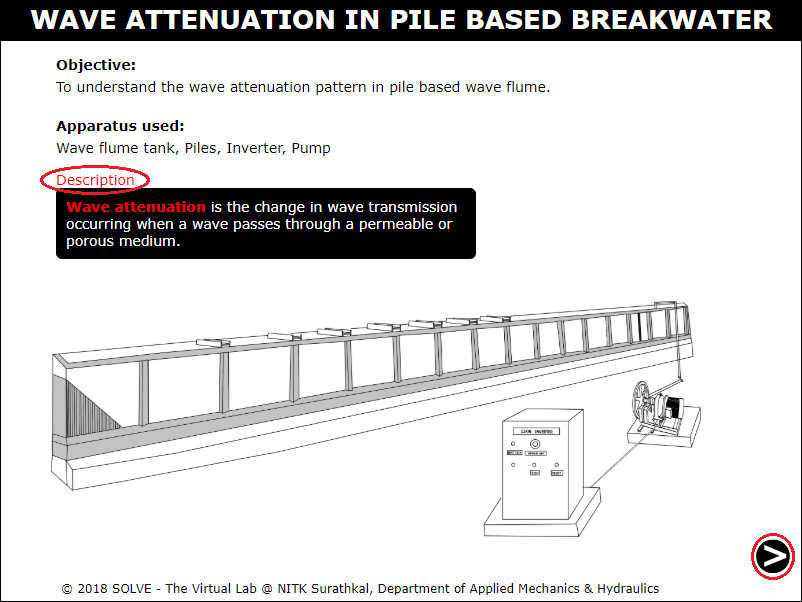 

2. Now select the spacing of the pile and click on NEXT button. 
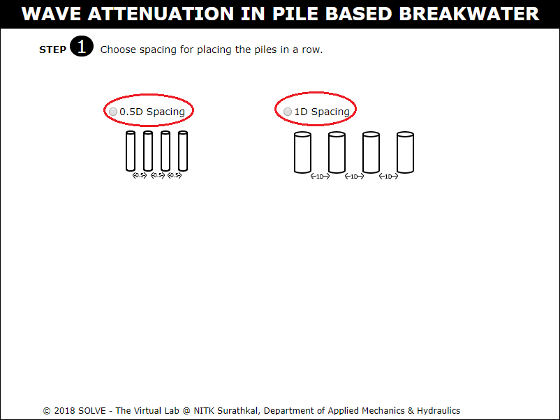 

3. The pile is placed in wave flume, Click NEXT button. 
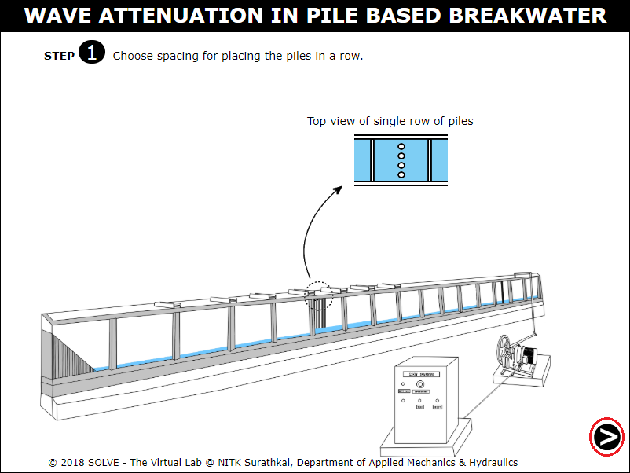 

4. Select the depth of water to be maintained in wave flume. 
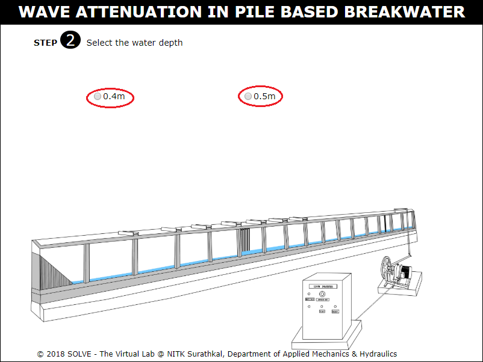 

5. Select the frequency and eccentricity from calibration table and then the wave period, wave height. 
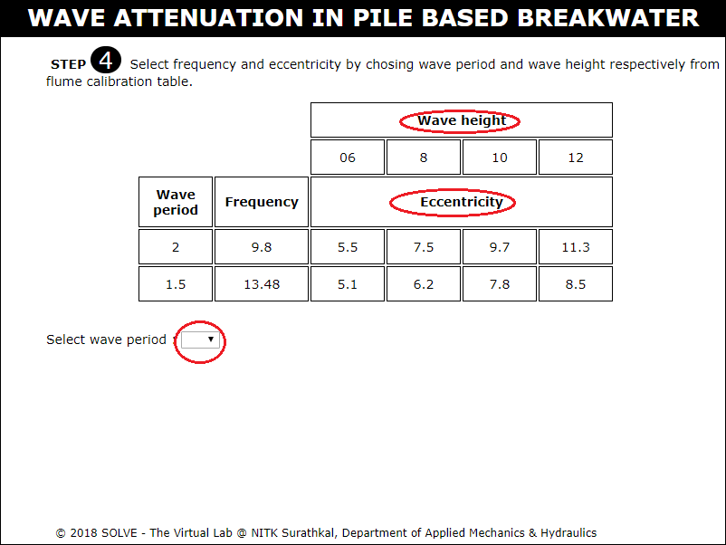 

6. Now set the selected frequency using speed knob. 
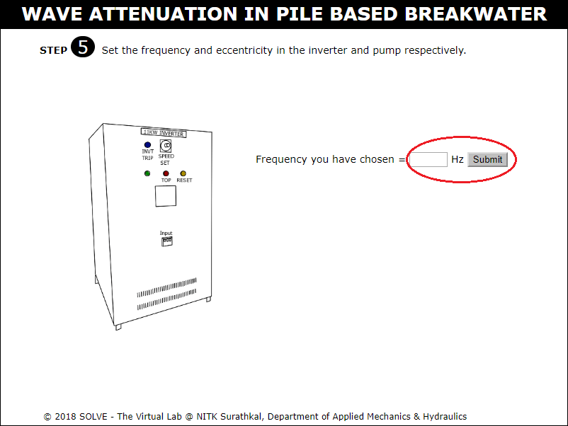 

7. Set the eccentricity by adjusting the knob. 
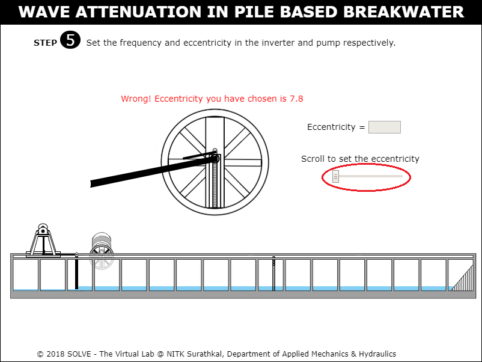 

8. Click on ON button to switch on the machine. 
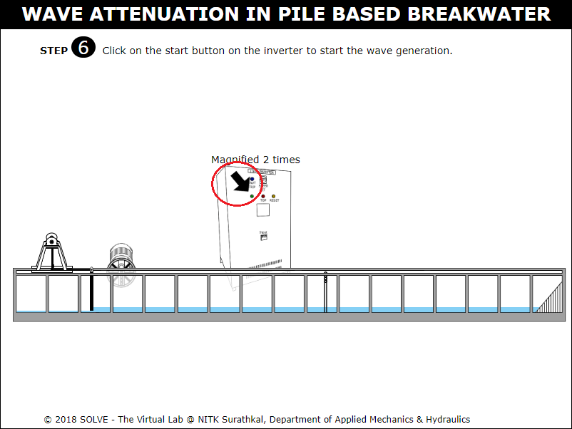 

9. View the wave attenuation pattern in the wave flume and click on zoom button to view in zoomed view. 
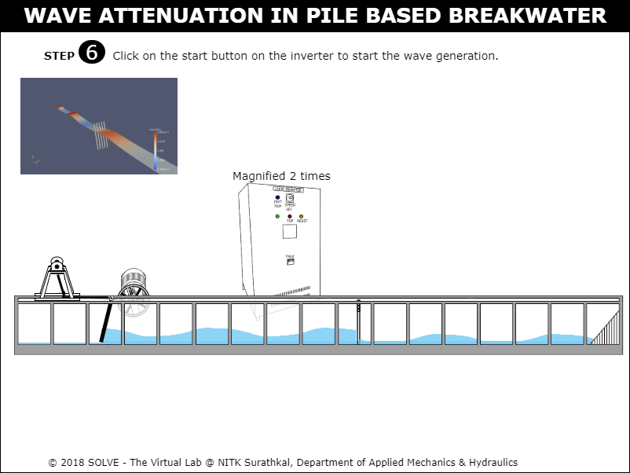 

#### Wave Attenuation in Two Row Pile Based Breakwater :

1. Go through the description and then click on NEXT button shown at the bottom right corner. 
 

2. Now select the spacing of the pile, breadth and then click on NEXT button. 
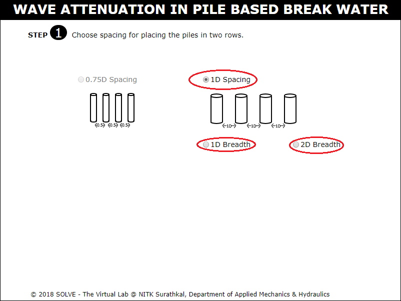 

3. The pile is placed in wave flume, Click NEXT button. 
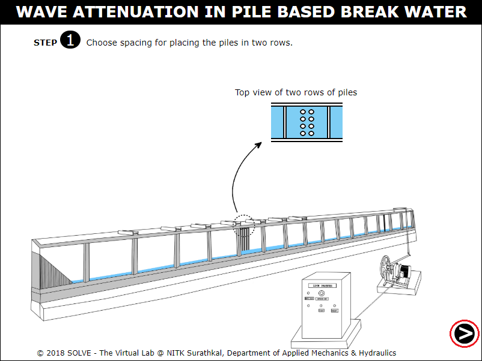 

4. Select the depth of water to be maintained in wave flume. 
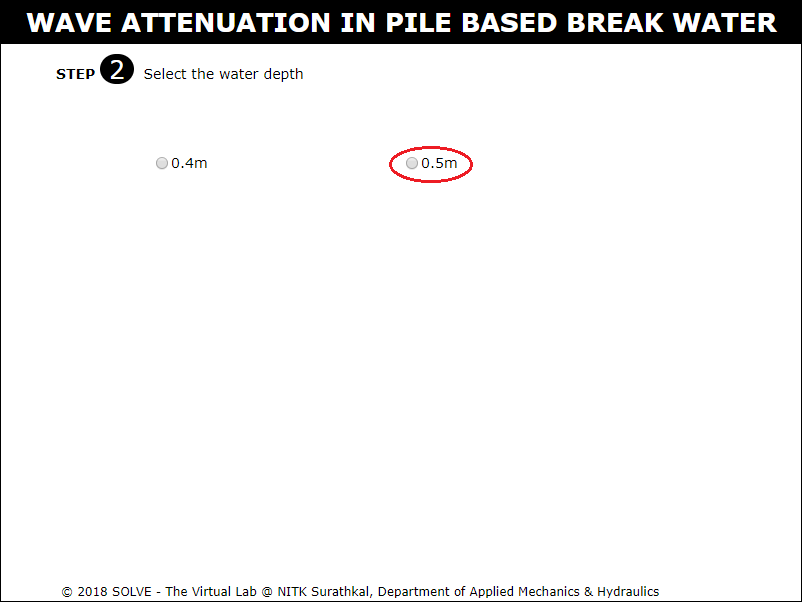 

5. Select the frequency and eccentricity from calibration table and then the wave period, wave height. 
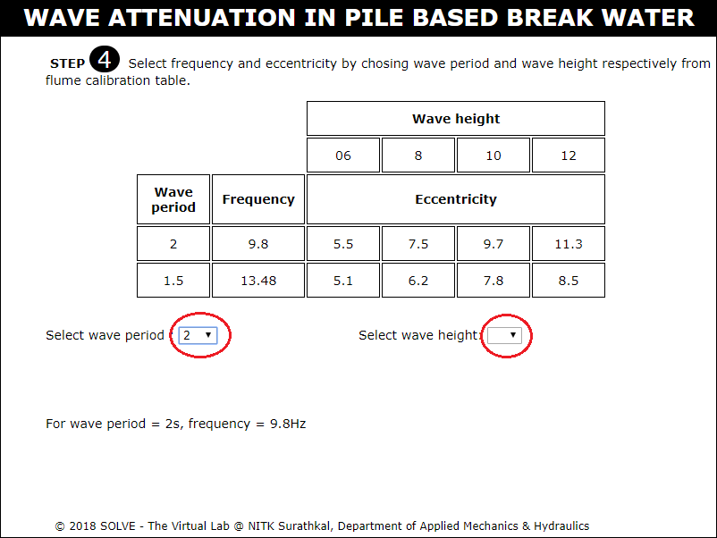 

6. Now set the selected frequency using speed knob. 
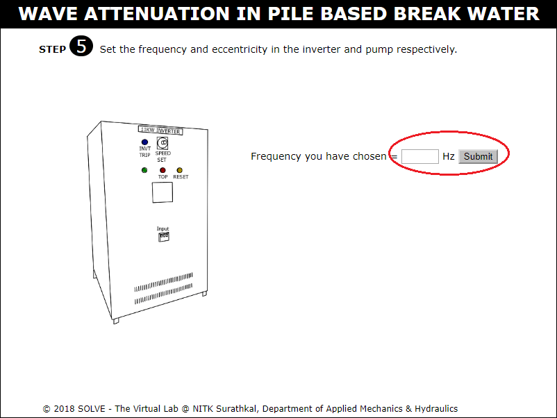 

7. Set the eccentricity by adjusting the knob. 
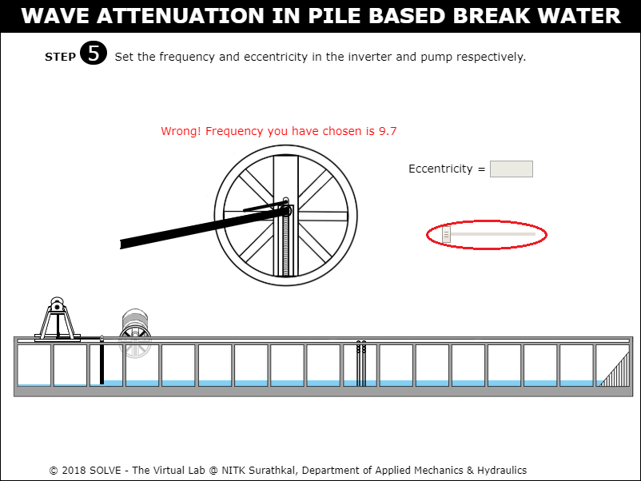 

8. Click on ON button to switch on the machine. 
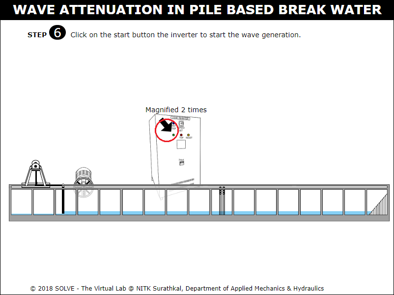 

9. View the wave attenuation pattern in the wave flume and click on zoom button to view in zoomed view. 
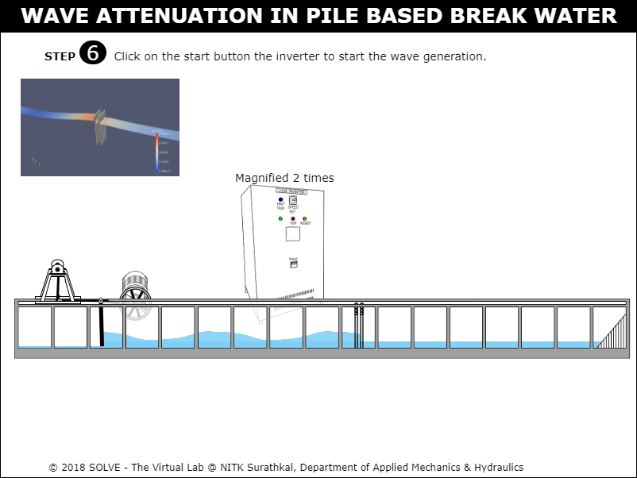 

10. Click on the title to view the wave attenuation pattern under different depth, breadth and wave period. 
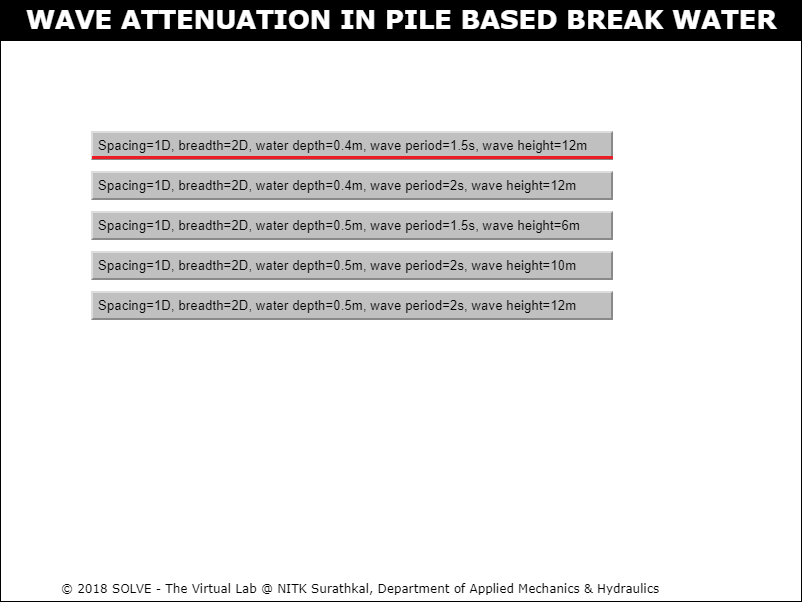 

11. View the wave steepness and transmission coefficient curve. 
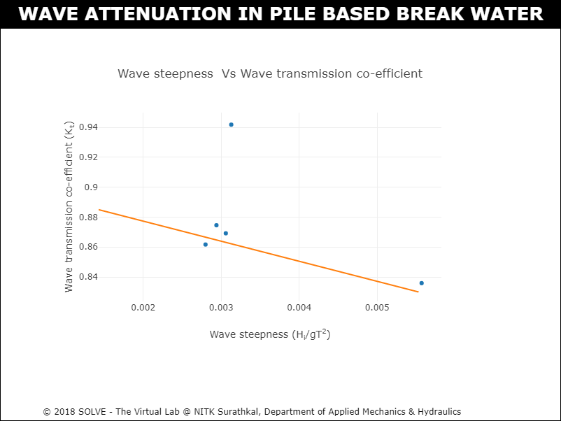 
